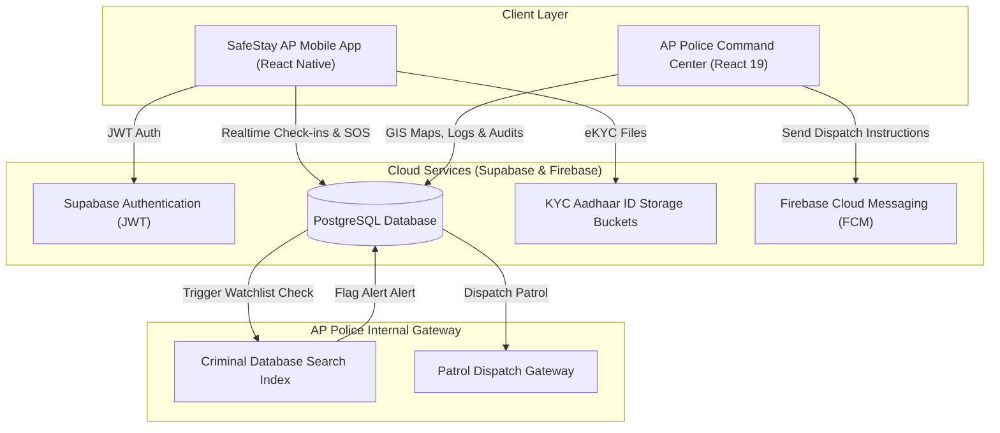

# 🛡️ SafeStay AP — Unified Ecosystem Technical Documentation

This document outlines the system architecture, database schema, verification engines, security protocols, and dashboard/mobile workflows for the **SafeStay AP** Paying Guest (PG) and co-living monitoring system. It serves as the definitive reference for developers, system architects, and police department technicians.

---

## 📖 Table of Contents
1. [Ecosystem Architecture](#1-ecosystem-architecture)
2. [Unified Database Schema (PostgreSQL & Supabase)](#2-unified-database-schema-postgresql--supabase)
3. [eKYC & Criminal Watchlist Engine](#3-ekyc--criminal-watchlist-engine)
4. [Emergency SOS Protocol (Silent vs. Audible)](#4-emergency-sos-protocol-silent-vs-audible)
5. [Ground Patrol & Dispatch Workflows](#5-ground-patrol--dispatch-workflows)
6. [Command Center Web Dashboard Architecture](#6-command-center-web-dashboard-architecture)
7. [CCTV Surveillance Control Center Architecture](#7-cctv-surveillance-control-center-architecture)
8. [Attribute-Based Access Control (ABAC) Policies](#8-attribute-based-access-control-abac-policies)

---

## 1. Ecosystem Architecture

The SafeStay AP system represents a serverless, real-time ecosystem divided into two client modules running on a unified cloud backend:

1. **SafeStay AP Mobile App (`/SafeStayAP`)**: A cross-platform mobile application written in React Native and Expo SDK 54. It handles guest onboarding, QR check-ins, eKYC validation, and panic SOS alarms.
2. **SafeStay AP Command Center (`/DASHBOARD_AP_POLICE`)**: A high-performance dashboard portal developed using React 19, TypeScript, and Vite 6. It gives district police teams geographical insight, dispatch controls, and property compliance approvals.

### Data Flow & Topology



---

## 2. Unified Database Schema (PostgreSQL & Supabase)

The database utilizes **PostgreSQL** hosted via **Supabase**. It leverages strict relational keys, custom enums, and row-level security (RLS) tables to separate guest data while providing aggregate surveillance views to the Police Command Center.

### Table Definitions SQL

```sql
-- ─── ENUMS AND CUSTOM TYPES ──────────────────────────────────────────
CREATE TYPE user_role AS ENUM ('guest', 'owner');
CREATE TYPE verification_status AS ENUM ('pending', 'submitted_physical', 'police_verified', 'approved', 'declined', 'docs_required');
CREATE TYPE booking_status AS ENUM ('pending', 'confirmed', 'checked_in', 'checked_out', 'cancelled');
CREATE TYPE severity_level AS ENUM ('low', 'medium', 'high', 'sos');
CREATE TYPE id_type AS ENUM ('aadhaar', 'pan', 'passport');
CREATE TYPE coguest_status AS ENUM ('invited', 'accepted', 'declined', 'expired');

-- ─── 1. CORE USER ACCOUNTS ───────────────────────────────────────────
CREATE TABLE users (
    id UUID REFERENCES auth.users ON DELETE CASCADE PRIMARY KEY,
    phone VARCHAR(15) UNIQUE NOT NULL,
    email VARCHAR(255) UNIQUE,
    role user_role NOT NULL DEFAULT 'guest',
    created_at TIMESTAMP WITH TIME ZONE DEFAULT timezone('utc'::text, now()) NOT NULL
);

-- ─── 2. GUEST eKYC RECORD FILES ───────────────────────────────────────
CREATE TABLE guest_profiles (
    user_id UUID REFERENCES users(id) ON DELETE CASCADE PRIMARY KEY,
    name VARCHAR(100) NOT NULL,
    emergency_contact_name VARCHAR(100) NOT NULL,
    emergency_contact_phone VARCHAR(15) NOT NULL,
    kyc_status verification_status NOT NULL DEFAULT 'pending',
    photo_url TEXT,
    updated_at TIMESTAMP WITH TIME ZONE DEFAULT timezone('utc'::text, now()) NOT NULL
);

-- ─── 3. HOST / OWNER REGISTRIES ────────────────────────────────────────
CREATE TABLE owner_profiles (
    user_id UUID REFERENCES users(id) ON DELETE CASCADE PRIMARY KEY,
    name VARCHAR(100) NOT NULL,
    company_name VARCHAR(150),
    is_verified BOOLEAN DEFAULT FALSE,
    bank_account_name VARCHAR(100),
    bank_account_number VARCHAR(30),
    bank_ifsc VARCHAR(15),
    updated_at TIMESTAMP WITH TIME ZONE DEFAULT timezone('utc'::text, now()) NOT NULL
);

-- ─── 4. PROPERTY ACCOMMODATIONS ───────────────────────────────────────
CREATE TABLE properties (
    id UUID PRIMARY KEY DEFAULT gen_random_uuid(),
    owner_id UUID REFERENCES owner_profiles(user_id) ON DELETE CASCADE NOT NULL,
    name VARCHAR(150) NOT NULL,
    type VARCHAR(50) DEFAULT 'pg' NOT NULL, -- pg, hostel, hotel, co-living
    description TEXT,
    address TEXT NOT NULL,
    city VARCHAR(100) NOT NULL,
    state VARCHAR(100) DEFAULT 'Andhra Pradesh' NOT NULL,
    pincode VARCHAR(10) NOT NULL,
    latitude DOUBLE PRECISION NOT NULL,
    longitude DOUBLE PRECISION NOT NULL,
    total_rooms INTEGER NOT NULL DEFAULT 0,
    available_rooms INTEGER NOT NULL DEFAULT 0,
    price_min NUMERIC(10, 2) NOT NULL DEFAULT 0.00,
    price_max NUMERIC(10, 2) NOT NULL DEFAULT 0.00,
    rating NUMERIC(3, 2) DEFAULT 0.00,
    review_count INTEGER DEFAULT 0,
    amenities TEXT[] DEFAULT '{}',
    rules TEXT[] DEFAULT '{}',
    images TEXT[] DEFAULT '{}',
    status VARCHAR(20) DEFAULT 'active' NOT NULL,
    verification_status verification_status NOT NULL DEFAULT 'pending',
    contact_phone VARCHAR(15) NOT NULL,
    created_at TIMESTAMP WITH TIME ZONE DEFAULT timezone('utc'::text, now()) NOT NULL,
    verification_officer VARCHAR(100),
    police_report_comments TEXT,
    submitted_date DATE,
    compliance_score INTEGER DEFAULT 100,
    cctv_working BOOLEAN DEFAULT TRUE,
    fire_safety BOOLEAN DEFAULT TRUE,
    last_audit DATE
);

-- ─── 5. ROOM INVENTORIES ──────────────────────────────────────────────
CREATE TABLE rooms (
    id UUID PRIMARY KEY DEFAULT gen_random_uuid(),
    property_id UUID REFERENCES properties(id) ON DELETE CASCADE NOT NULL,
    room_number VARCHAR(20) NOT NULL,
    type VARCHAR(30) NOT NULL, -- single, double, triple, dormitory
    floor INTEGER NOT NULL,
    capacity INTEGER NOT NULL,
    current_occupancy INTEGER DEFAULT 0 NOT NULL,
    price_per_month NUMERIC(10,2) NOT NULL,
    price_per_day NUMERIC(10,2) NOT NULL,
    status VARCHAR(20) DEFAULT 'available' NOT NULL,
    amenities TEXT[] DEFAULT '{}',
    images TEXT[] DEFAULT '{}'
);

-- ─── 6. OCCUPANCY & CHECK-IN LOGS ──────────────────────────────────────
CREATE TABLE bookings (
    id UUID PRIMARY KEY DEFAULT gen_random_uuid(),
    guest_id UUID REFERENCES guest_profiles(user_id) NOT NULL,
    property_id UUID REFERENCES properties(id) NOT NULL,
    room_id UUID REFERENCES rooms(id) NOT NULL,
    check_in DATE NOT NULL,
    check_out DATE NOT NULL,
    status booking_status NOT NULL DEFAULT 'pending',
    total_amount NUMERIC(10,2) NOT NULL,
    paid_amount NUMERIC(10,2) DEFAULT 0.00 NOT NULL,
    guest_count INTEGER DEFAULT 1 NOT NULL,
    special_requests TEXT,
    qr_code VARCHAR(255) UNIQUE NOT NULL,
    created_at TIMESTAMP WITH TIME ZONE DEFAULT timezone('utc'::text, now()) NOT NULL,
    approved_at TIMESTAMP WITH TIME ZONE,
    checked_in_at TIMESTAMP WITH TIME ZONE,
    checked_out_at TIMESTAMP WITH TIME ZONE
);

-- ─── 7. ACTIVE ALERTS & INCIDENTS ──────────────────────────────────────
CREATE TABLE alerts (
    id UUID PRIMARY KEY DEFAULT gen_random_uuid(),
    property_id UUID REFERENCES properties(id) ON DELETE CASCADE NOT NULL,
    guest_id UUID REFERENCES guest_profiles(user_id) ON DELETE CASCADE NOT NULL,
    title VARCHAR(150) NOT NULL,
    description TEXT,
    severity severity_level NOT NULL DEFAULT 'sos',
    is_resolved BOOLEAN DEFAULT FALSE NOT NULL,
    resolved_at TIMESTAMP WITH TIME ZONE,
    latitude DOUBLE PRECISION,
    longitude DOUBLE PRECISION,
    created_at TIMESTAMP WITH TIME ZONE DEFAULT timezone('utc'::text, now()) NOT NULL
);
```

---

## 3. eKYC & Criminal Watchlist Engine

When guests or co-guests check in at a property, their credentials are validated using automated background tasks linked to government databases.

```
Guest Uploads ID Document  -->  OCR Text Extraction  -->  Watchlist Match Check  -->  Flag Triggered?
                                (Aadhaar, Passport)        (State Crime Index)          |
                                                                                        |--> [YES] Notify Control Room
                                                                                        |--> [NO] Clear Profile Check
```

### Script Pattern (Matching Logic)

The matching engine searches candidate profiles for active warrants or suspect matches:

```typescript
export function verifyAgainstPoliceWatchlist(candidate: {
  name: string;
  idNumber: string;
  dob?: string;
}): { matched: boolean; reason: string; caseId?: string } {
  const normalizedCandidate = candidate.name.toLowerCase();
  
  // Simulated State Police Criminal Watchlist Index matches
  const watchlistIndices = [
    { suspect: 'raju', reason: 'Section 420 IPC (Forgery & Cheating)', caseId: 'AP-W-209' },
    { suspect: 'sunder', reason: 'Section 379 IPC (Theft & Robbery)', caseId: 'AP-W-112' },
    { suspect: 'wanted criminal', reason: 'Multiple warrants outstanding', caseId: 'AP-W-007' }
  ];

  for (const match of watchlistIndices) {
    if (normalizedCandidate.includes(match.suspect)) {
      return {
        matched: true,
        reason: `Flagged Match: ${match.reason}`,
        caseId: match.caseId
      };
    }
  }

  return { matched: false, reason: 'Cleared against local criminal databases' };
}
```

---

## 4. Emergency SOS Protocol (Silent vs. Audible)

The mobile application implements a dual-mode panic system designed to protect guest safety in high-danger scenarios.

```
                   +------------------------+
                   |  SOS Button Triggered  |
                   +-----------+------------+
                               |
                   +-----------v-----------+
                   |   Check Mode Settings |
                   +-----+-----------+-----+
                         |           |
             Audible SOS |           | Silent SOS
                         |           |
       +-----------------v-+       +-v------------------+
       | - Play High Siren |       | - Mute Speaker     |
       | - Flashing UI     |       | - Keep UI Normal   |
       | - Vibration Pulsing|       | - Single Haptic    |
       +-----------------+-+       +-+------------------+
                         |           |
                         +-----v-----+
                               |
                   +-----------v-----------+
                   | Dispatch GPS Payload  |
                   |   (WebSocket Sync)    |
                   +-----------+-----------+
                               |
              +----------------v----------------+
              | - AP Police Control Dispatch    |
              | - Nearby Ground Patrol Alert    |
              +---------------------------------+
```

### JSON Dispatch Payload Schema

```json
{
  "alert_id": "ALT-SOS-9823",
  "client_timestamp": "2026-06-06T12:15:30.291Z",
  "silent_mode": true,
  "guest_id": "GUEST-UUID-991",
  "facility_context": {
    "property_name": "Lotus Girls PG",
    "room_number": "204",
    "district": "NTR Vijayawada"
  },
  "coordinates": {
    "latitude": 16.506174,
    "longitude": 80.648015,
    "accuracy_radius_meters": 4.2
  }
}
```

---

## 5. Ground Patrol & Dispatch Workflows

The dashboard provides a unified panel to coordinate emergency dispatches and check-ins:

1. **SOS Dispatching**: Tapping an active incident automatically alerts the dispatch queue. The dispatcher assigns emergency officers to the target property.
2. **Patrol Verification Workflow**:
   * **Submitted for Review**: When a new PG registers, its status is set to `submitted_physical`.
   * **Patrol Assignment**: Command staff uses the dashboard's "Send Patrol" option to select a Ground Officer (e.g., *SI Ramesh Kumar*).
   * **Inspection Roster**: Once the officer completes a physical walkthrough and verifies CCTV/fire compliance, the status changes to `police_verified`.
   * **Final Review**: Command staff reviews the officer's log and either approves (`approved`), declines (`declined`), or requests additional documents (`docs_required`).

---

## 6. Command Center Web Dashboard Architecture

### State & Modal System
The web dashboard operates as a Single-Page Application (SPA) driven by state hooks in `src/App.tsx`. 

* **State Synchronization**: Live check-in alerts and SOS dispatches are synchronised in a single global state model `data`.
* **Zero Browser Popups**: All prompt actions use a custom React overlay dialog driven by the `customDialog` state object:
  ```typescript
  interface CustomDialogConfig {
    type: 'alert' | 'prompt';
    title: string;
    message?: string;
    placeholder?: string;
    onConfirm: (input: string) => void;
  }
  ```

* **Geospatial Map Integrations**: Embedded Leaflet.js maps link map marker selections with page-wide filters. Clicking a zone map marker highlights that sector and opens a PG-to-occupant roster drill-down layout.
* **Custom Styled Components & Buttons**: Restyled native select elements (`.filter-select`) with custom chevron arrows matching the primary neon-lime theme, and fully custom button controls (`.btn-action-small` & `.btn-action-large`) utilizing custom color states for success, warning, and danger states.
* **Scroll Viewport Overrides**: Set `overflow: visible` on primary tab layout glass cards (`pg-applications`, `settings`, and `search`) to let the viewport's parent container handle natural document scrolling without clipping list items.

---

## 7. CCTV Surveillance Control Center Architecture

To ensure strict compliance with guest safety protocols, the dashboard features a dedicated **CCTV Feeds** management dashboard. This module consolidates real-time feeds from registered property gateways into a unified interface:

1. **Resolution & Telemetry Controls**: High-definition camera stream controls support toggling between 720p, 1080p, and 4K command-center feed priority.
2. **AI Facial Auditing Sweep**: An interactive biometric matcher checks guest gate entrance templates against government Aadhaar blacklists in real-time.
3. **Stream Metadata Tracking**: Provides technical diagnostics including source IP bounds (e.g. `192.168.1.104`), latency ping (14ms), and adaptive bitrate logs.

---

## 8. Attribute-Based Access Control (ABAC) Policies

The dashboard secures administrative actions using an **Attribute-Based Access Control (ABAC)** framework implemented in `src/App.tsx`. This restricts high-impact actions like physical verification reports, SOS dispatches, and new property approvals to authorized officers based on specific profile attributes:

* **Clearance Rank Bind**: Ranks include `DCP (IPS)`, `Inspector`, `Sub-Inspector`, and `Constable`. Clearances map directly to allowed operations.
* **Regional Jurisdiction Bind**: Binds officer authorizations to specific geographical boundaries (e.g., `NTR Vijayawada`, `Visakhapatnam`, `Guntur City`).
* **Active Temporal Constraints (Shift schedules)**: Access checks evaluate if the access attempt conforms to the officer's shift parameters (e.g., `Day Shift (08:00 - 16:00)`, `24/7 Unlimited`).
* **Interactive Policy Simulator**: Enables testing and dry-running permissions validation by matching selected officer profile attributes against resource policies (e.g. `Approve PG`, `Watchlist Access`, `CCTV Access`).

